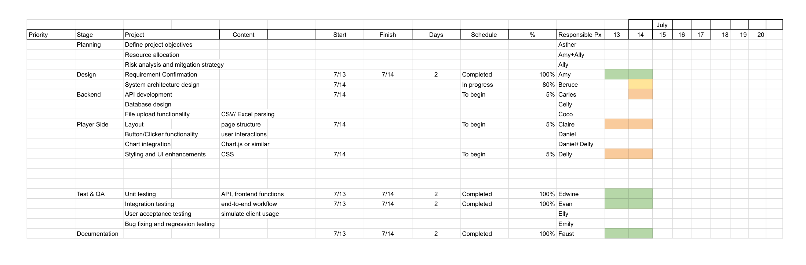
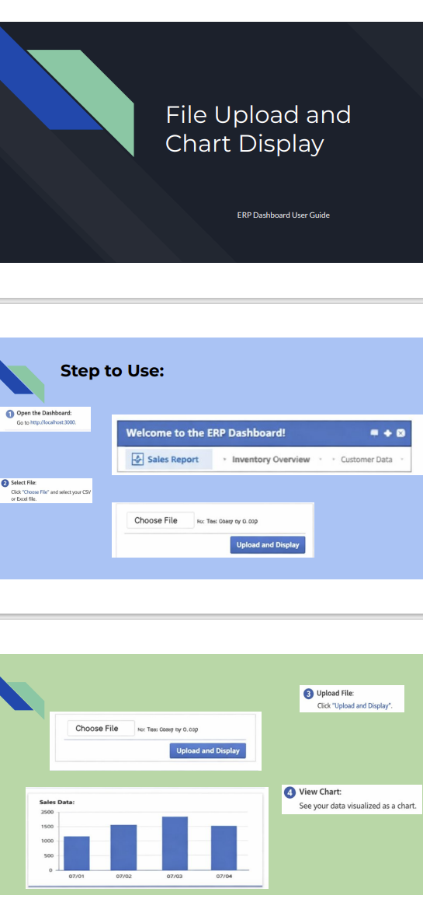

# 專案管理_ERP

此專案展示了管理與協調 ERP 專案。 包含專案管理所需的文件、甘特圖、使用者手冊，以及後端程式檔案等。

---

##  專案檔案

| 檔案 | 說明 |
|------|------|
| `index.js` | ERP 儀表板前端入口檔案 |
| `server.js` | ERP 儀表板後端伺服器程式 |
| `Grantt_for_ERP.pdf` | 專案時程與工作排程 |
| `User_Guide_forERP.pdf` | ERP 儀表板使用者手冊 |

---

## 專案管理總覽

### Trello 看板（給工程師）
> 用來追蹤技術任務、進度與協作。
- [查看 Trello 看板 (線上)](https://trello.com/b/xxxxxx)  
- [下載 Trello 看板快照 (PDF)](TrelloBoard.pdf)   

### 甘特圖（給老闆 / 管理層）
> 提供與匯報專案整體時程、里程碑與進度規劃。
    

### 使用者手冊（給客戶）
> 提供系統操作說明，確保客戶能順利使用 ERP 儀表板。
   
- [下載使用者手冊 (PDF)](User_Guide_forERP.pdf)  

---

##  Trello 標籤 
- 🔴 後端 / API 開發  
- 🟡 系統設計 / 架構  
- 🟢 前端 UI / 整合  
- 🔵 文件 / 使用者手冊  
- 🟣 測試 / 品質保證  
- 🟠 管理 / 專案管理工作  
- ⚪ 已完成 

---

