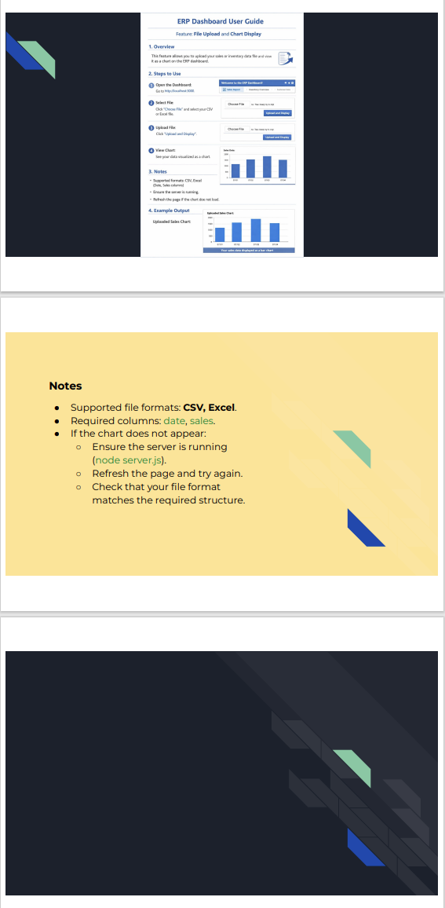

# 專案管理_ERP

展示管理與協調專案的能力。 以下包含專案管理所需的文件、甘特圖、使用者手冊，以及後端程式檔案等。

---
**ERP 概念**

用 ERP 企業資源規劃概念作為專案管理的框架。並非完整導入 ERP 系統，而是將 ERP 作為概念來運作不同階段的任務。
- 整合：規劃、設計、後端、前端、測試與文件串接成一個統一流程。
- 管理：人力、時間與工具有效分配。
- 流程透明度：讓專案進度透明且可追蹤，類似 ERP 儀表板的呈現方式。

注意：這裡的 ERP 並非複雜系統的導入，而是作為一個簡單概念，幫助專案管理結構化，並凸顯整合與透明的重要性。

---
# 工作流程

構化的專案管理流程，以確保透明度、對齊與交付：

**需求蒐集**
- 在會議中收集主管需求與新客戶需求。
- 立即紀錄變更，避免資訊不一致。

**任務追蹤**
- 將需求拆解為可執行的任務。
- 明確標註（後端、前端、QA、文件）並分派給工程師。
- 每週更新，維持工程團隊的衝刺節奏。

**時間規劃**
- 將任務與行程視覺化。
- 每週更新給管理層，確保進度透明。
- 當範疇變更時，調整時間表。

**文件與溝通**
- 維護技術文件與 PM 紀錄。
- 客戶回饋或新功能後更新使用者指南。
- 確保工程師、管理層與客戶之間的跨部門清晰度。

**UAT 測試**
- 支援客戶進行使用者驗收測試。
- 在發佈前驗證 ERP 儀表板功能。
- 收集回饋並導入 Trello 迭代。

**交付與反思**
- 提交完整文件的 ERP 儀表板。
- 反思流程效率與團隊合作。
- 找出未來專案的改進方向。

---
##  專案檔案

| 檔案 | 說明 |
|------|------|
| `index.js` | ERP 儀表板前端入口檔案 |
| `server.js` | ERP 儀表板後端伺服器程式 |
| `Grantt_for_ERP.pdf` | 專案時程與工作排程 |
| `User_Guide_forERP.pdf` | ERP 儀表板使用者手冊 |

---

## 專案管理總覽

### Trello （給工程師）
> 用來追蹤技術任務、進度與協作。

 [查看線上 Trello](https://trello.com/invite/b/6a56f5d03ec78862594e025d/ATTIfde492f2c1d0caa745c47d3dc8df73fbD2982C47/🗓️-weekly-workflow)  

### 甘特圖（給老闆 / 管理層）
> 提供與匯報專案整體時程、里程碑與進度規劃。

 

進階版甘特圖
> 目的： 進階版甘特圖顯示優於基礎版的需求，確保能反映真實需求，例如資安、擴展性與維護性。

 

### 使用者手冊（給客戶）
> 提供系統操作說明，確保客戶能順利使用 ERP 儀表板。
-  [下載使用者手冊 (PDF)](User_Guide_forERP.pdf)
  

---
## 專案管理成果

- 透過 Trello 看板清楚追蹤任務（每週更新給工程團隊）
- 使用甘特圖結構化時間線（每週更新給管理層，確保進度透明）
- 會議後持續對齊 —— 立即更新主管需求與客戶新需求
- 整合技術與專案管理文件
- 提交完整 ERP 儀表板與詳細使用者指南
- 支援 UAT 測試，協助驗證系統功能後再發佈
---
##  Trello 標籤
 🔴 後端 / API 開發  
 🟡 系統設計 / 架構  
 🟢 前端 UI / 整合  
 🔵 文件 / 使用者手冊  
 🟣 測試 / 品質保證  
 🟠 管理 / 專案管理工作  
 ⚪ 已完成 

---
## 技術
- Node.js
- Express.js
- Chart.js
- CSV/Excel 

---
## 作者
Lirong📌  
專案管理 | Scrum 認證 (PSM I)
台灣，台北
